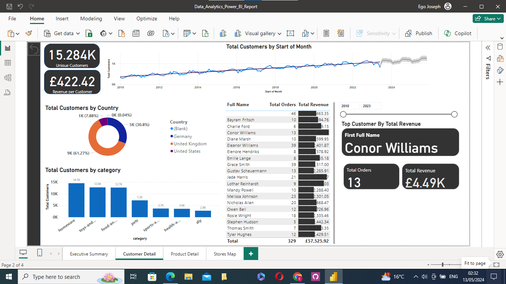
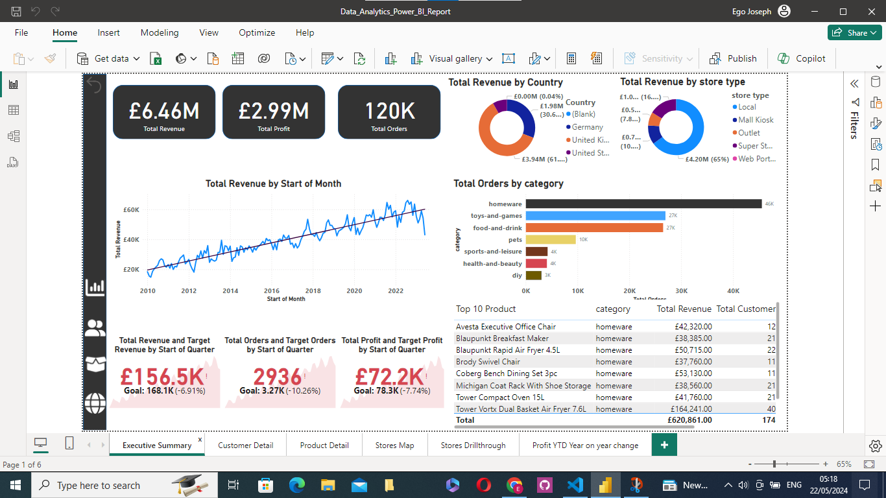
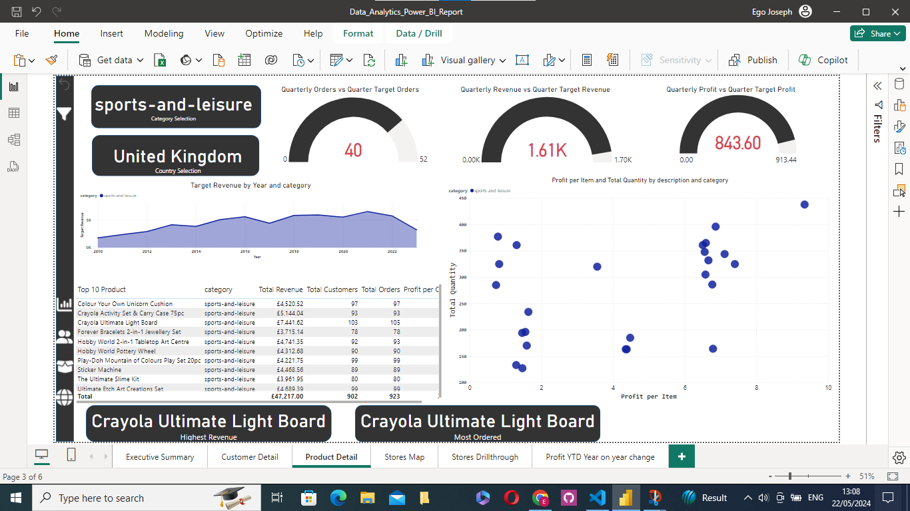
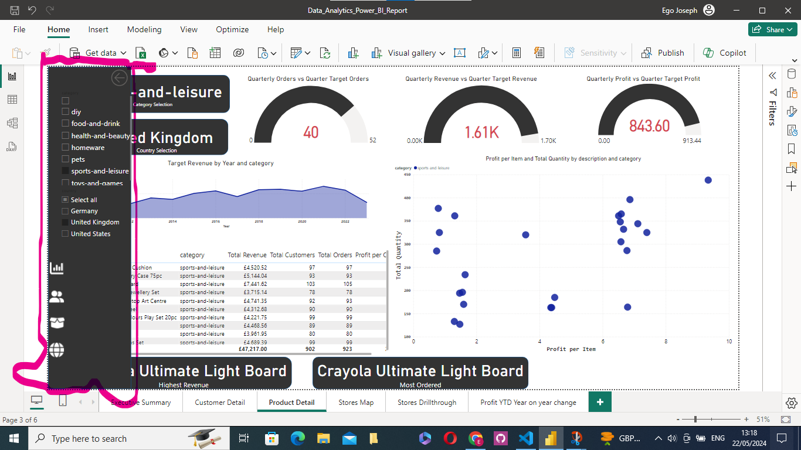
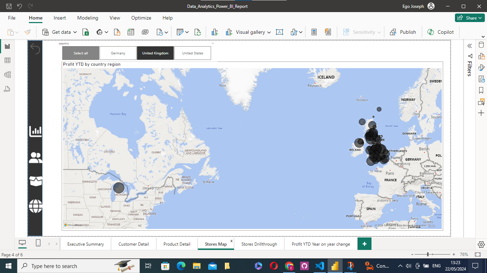
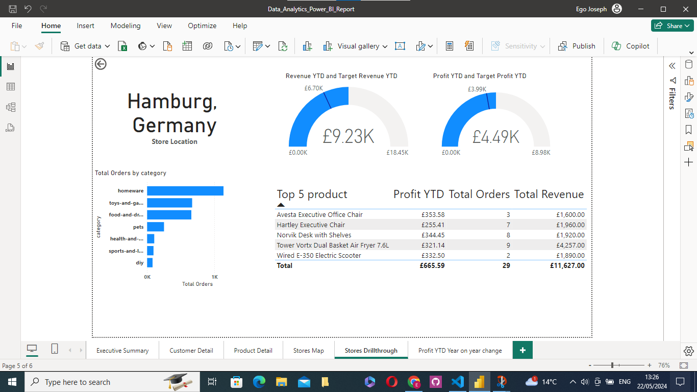
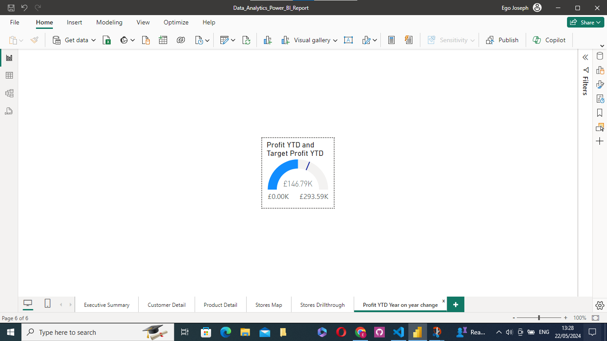
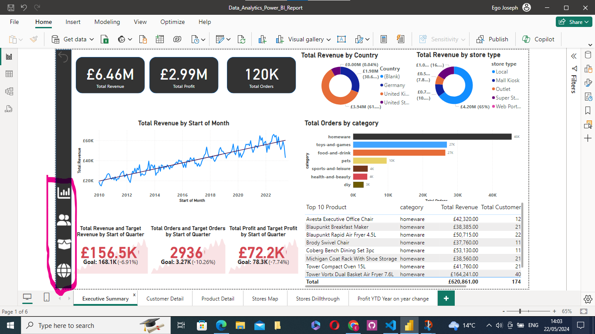

# Data Analytics Power BI Report

## Description
This project uses Microsoft Power BI to design a comprehensive Quarterly report for a medium-sized international retailer who is keen on elevating their business intelligence practices. With operations spanning across different regions, they've accumulated large amounts of sales from disparate sources over the years.
Recognizing the value of this data, they aim to transform it into actionable insights for better decision-making. This will involve extracting and transforming data from various origins, designing a robust data model rooted in a star-based schema, and then constructing a multi-page report.
The report will present a high-level business summary tailored for C-suite executives, and also give insights into their highest value customers segmented by sales region, provide a detailed analysis of top-performing products categorised by type against their sales targets, and a visually appealing map visual that spotlights the performance metrics of their retail outlets across different territories.

## project status
The project is still on the development stage **3-05-2024**

## Table of contents
1. Import The Data into Power BI
    - Load and Transform the order Table
    - Import and Transform the products Dimension Table
    - Import and Transform the store Dimension Table
    - Import and Transform the customer table
2. Creating The Data Model
    - created a date table with DAX
    - built the star schema data model
    - created a measure table
    - created key measures like
      - Total Orders
      - Total Revenue
      - Total Profit
      - Total Customers
      - Total Quantity
      - Profit YTD
      - Revenue YTD
    - creating date and geography hierarchies
      - Created a date hierarchy using the following levels:
        - Start of Year
        - Start of Quarter
        - Start of Month
        - Start of Week
        - Date
      - Created a new calculated column in the Stores table called Country 
      - Created a new calculated column in the Stores table called Geography
      - Ensured that the following columns have the correct data category        assigned, as follows
        - Region : Continent
        - Country : Country
        - Country Region : State or Province
      - Created a Geography hierarchy using the following levels:
        - Region
        - Country
        - Country Region
3. Set up the report 
    - Created the Executive Summary,Customer Detail,Product Detail,Stores Map report pages
    - Added a navigation sidebar to the report pages
4. Built the Customer Detail page
    - creating headline card visuals
      - created two reactangular shapes that will act as base to the card visuals
      - Added a card visual for Total customers measure, and also renamed it to Uniqque customers
      - created a new measure called [Revenue per Customer] in the measure table. this was gotten by [Total Revenue] divided by the [Total Customers].
      - Added a card visual for  the [Revenue per Customer] measure
    - created the summary charts
      - Added a donut chart by using the customer[Country] column to filter the [Total Customers] measure
      - Added  a Column Chart visual showing the number of customers who purchased each product category, using the Products[Category] column to filter the [Total Customers] measure 
    - creating the line chart
      - Added a Line Chart visual to the top of the page. It should show [Total Customers] on the Y axis, and use the Date Hierarchy we created previously for the X axis. Allow users to drill down to the month level
      - Added a trend line, and a forecast for the next 10 periods with a 95% confidence interval
    - Creating the Top 20 customers table
      - Created a new table which should show each customer's full name, revenue, and number of orders and displays the top 20 customers, filtered by revenue.
      - Added conditional formatting to the revenue column, to display data bars for the revenue values
    - Creating the top customers card
      - Created a set of three card visuals that provide insights about the top customer by revenue. They  displays the top customer's name, the number of orders made by the customer, and the total revenue generated by the customer.
    - Adding a Date slicer
      - Added a date slicer to allow users to filter the page by year, using the between slicer style.
- This is how the  Customer Detail Report page  looks like after the above   actions
  

5. Creating an Executive Summary Page
   - Created Three Card visuals for Total Revenue, Total Orders and Total Profit measures with three shapes acting as the card background

   - Added a Revenue Trendiing Line Chart with X axis set to  Date Hierarchy, with only the Start of Year, Start of Quarter and Start of Month levels displayed, and y axis set to Total Revenue
   - Added Donurt chart for revenue by country and store type
   - Added a bar chart of Orders by product category
   - Added KPI visuals
    - Created KPIs for Quarterly Revenue, Orders and Profit using Targets, equal to 5% growth in each measure compared to the previous quarter
   - This is how the the Executive summary Report page looks like after the above actions
  

6. Creating a Product detail report page
   - Added a set of three gauges visuals, showing the current-quarter performance of Orders, Revenue and Profit against a quarterly target of 10% quarter-on-quarter growth in all three metrics.
   - Added two filter state card with the following DAX expression
    - Category Selection = IF(ISFILTERED(Products[Category]), SELECTEDVALUE(Products[Category]), "No Selection")
    - Country Selection = IF(ISFILTERED(Stores[Country]), SELECTEDVALUE(Stores[Country]), "No Selection")
   - Added an area chart of Revenue by product category with x axis Dates[Start of Quarter], y axis  Total Revenue and legend, Products[Category]
   - Added top 10 products table showing the following columns
    - Product Description
    - Total Revenue
    - Total Customers
    - Total Orders
    - Profit per Order
   - Added a Scatter Graph of  quantity sold vs profit  per item configured as followed
    
     - Values should be Products[Description]
     - X -Axis should be Products[Profit per Item]
     - Y-Axis should be Orders[Total Quantity]
     - Legend should be Products[Category]
   - This is how the the Product Detail Report page looks like after the above actions 
   
   -  created a slicer toolbar
    
  7. Creating a store map page
     - Added a map visual with location field set to geography hierachy and bubble size set to profit YTD
     - Added a country slicer with the slicer field set to and format section set as Tile
   - This is how the the Store Map Report page looks like after the above actions
    
     - Added a store drill through page 
     
     - Added a store Tooltip page
     
      - Added a store Tooltip page that will make it possible to see each store's year-to-date profit performance against the profit target just by hovering the mouse over a store on the map
  8. Fixing Cross-Filtering
    - Executive Summary Page
      - Product Category bar chart and Top 10 Products table should not filter the card visuals or KPIs
    -  Customer Detail Page
      - Top 20 Customers table should not filter any of the other visuals - Total Customers by Product Donut Chart should not affect the Customers line graph - Total Customers by Country donut chart should cross-filter Total Customers by Product donut Chart
    - Product Detail Page
      - Orders vs. Profitability scatter graph should not affect any other visuals - Top 10 Products table should not affect any other visuals
    -  Added navigation buttons for the individual report pages.
    

  9. For milestone_10 , after connecting to the sql database 'orders-db' in the azure database, run the following files in the link below

  ```
  question_sql_csv_files
  
  ```

  
  

  
        
        


## File Structure


## Installation and Usage
clone the repository by running the following command inside a terminal

```
https://github.com/Egojoefavour/data-analytics-power-bi-report616.git

```
Then inside the folder use Power BI Desktop application to open following file

```
Data_Analytics_Power_BI_Report.pbix

```


## licence Information